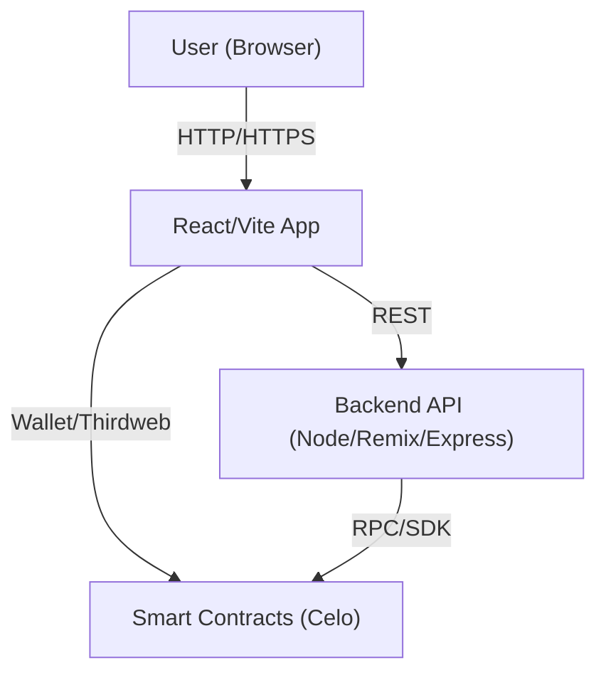

# Frontend Documentation

## ⚙️ Vite Configuration (vite.config.js)

Vite requires minimal configuration, making it easy to set up and run your project.

1. **Install dependencies**: Run the command `npm i` to install and auto-configure dependencies as outlined in the `package.json` file:

2. **Start the development server**: Use the command `npm start` to start a development server with hot module replacement enabled by default:

3. **Access the application**: Once the server is running, open your browser and navigate to: `http://localhost:5173`. This will load the to access the frontend interface.
   
   
## ES6 Module Imports

Files are imported using ES6 syntax, keeping the code modular and organized.


## 🧩 Importing Components 
Components are stored in the ```src/components/``` directory and imported directly into the pages (or other components). This helps maintain a modular and reusable structure, improving maintainability.


## 🎨 Importing Styles and Fonts

Stylesheets ``(*.css)`` are located in the ```src/styles/``` directory.
Fonts are placed in the ```src/fonts/``` directory and are referenced within the CSS files.

This structure ensures separation of concerns between components, styles, and pages, making it easier to manage and scale the React application. 


The frontend interacts with the backend's API via HTTP requests to the defined routes.

Future iterations of the frontend will integrate with the backend's blockchain-based enhancements, including smart contract calls for specific actions.

## Current Fixes:

    1. UI Improvement: Enhanced CSS responsiveness for better user experience across different screen sizes and devices.
    
    2. API Integration: Implementation of more API calls to fetch data from the backend

## How to run the application: 
<h4> I will only provide the docker version since it is the only platform independent and most reliable form of maintaing different applications with their runtimes. 
</h4> 

## Docker commands 
<h5> First start by building the application & downloading its dependencies. 
</h5>
    1. <bold>docker build --build-arg VITE_THIRDWEB_CLIENT_ID="api_key_sourced_from_thirdweb" -t wd-frontend .</bold>
<h5> Then run the application. </h5>
    2. <italic>docker run -p 8080:80 wd-frontend</italic>

## I hope you enjoy using the application as much as I enjoyed building it.

---

# 🧑‍💼 User Pilot Guide

## Accessing the Application
- Visit: https://washikadao.xyz or https://www.washikadao.xyz
- No installation required; use any modern browser.

## Getting Started
1. **Register or Connect Wallet**: Use the Karibu button to create an in-app wallet or connect an existing wallet (e.g., MetaMask).
2. **Explore Features**:
   - View and join DAOs
   - Propose and vote on initiatives
   - Manage your profile and transactions
3. **Support**: For help, contact the project lead or support email provided by your organization.

## Key Features
- Transparent DAO management
- Community proposals and voting
- Educational blog section
- Mobile-friendly interface
- **React Router v7**: Latest version, with all routing handled via `react-router`. SSR (Server-Side Rendering) is enabled by default in the framework and Vite config.
- **Tailwind CSS**: Utility-first CSS framework, with [framework mode](https://tailwindcss.com/docs/framework-mode) enabled for optimal performance and DX. See `tailwind.config.js` for customization.
- **Vite**: Fast build tool and dev server.

---

# 🛠️ Technical Documentation

## Project Structure
- `src/` — Main source code (components, pages, hooks, utils)
- `public/` — Static assets (images, blog data)
- `Dockerfile` — Multi-stage build for production
- `nginx.conf` — SPA routing and static file serving
- `src/styles/index.css` — Tailwind CSS entrypoint (starts with `@import "tailwindcss";`)
- `tailwind.config.js` — Tailwind config, framework mode enabled
- `vite.config.ts` — Vite config, SSR enabled

## Local Development
1. `npm i` — Install dependencies
2. `npm start` — Start Vite dev server (default: http://localhost:5173)

## Production Deployment
- Build: `docker build --build-arg VITE_THIRDWEB_CLIENT_ID="<your_key>" -t wd-frontend .`
- Run: `docker run -p 8080:80 wd-frontend`
- Nginx serves on port 80 inside the container (mapped to 8080 on host)

## Environment Variables
- `VITE_THIRDWEB_CLIENT_ID` — Required for blockchain wallet integration

## Testing
- Run `npm test` for unit tests (Vitest)

---


# 📘 Product Documentation

## 1. Introduction & Vision
Washika DAO is a platform empowering community savings groups (Chamas, SACCOS, VICOBAs) with transparent, blockchain-based management. The vision is to provide accessible, secure, and user-friendly tools for group savings, lending, and governance, leveraging smart contracts and modern web technologies.

## 2. Technology Stack & Architecture
- **Frontend:** React 18, Vite, TypeScript, Tailwind CSS, Redux Toolkit, React Router V6
// TODO: Migrate to React Router V7, Remix Edition, the latest edition
- **Blockchain Integration:** Thirdweb SDK, ethers.js
- **Backend:** (Blackbox for this doc) — handles API, business logic, and smart contract orchestration
- **Smart Contracts:** (Blackbox for this doc) — deployed on Celo (testnet/mainnet)
- **Containerization:** Docker, Nginx
- **Deployment:** Coolify, Docker Compose

### Architecture Overview
- **Frontend** communicates with the backend for data and with the blockchain via Thirdweb for wallet and contract interactions.
- **Backend** (future: will own all blockchain logic for consistency and security).
- **Smart Contracts** enforce DAO rules, multisig, and proposals on-chain.

## 3. Frontend/Backend/Smart Contract Integration
- **Current:**
  - Frontend directly interacts with smart contracts for wallet, DAO, and multisig actions.
  - Backend provides API for off-chain data and coordination.
- **Future:**
  - All blockchain logic (e.g., multisig, proposals) will be migrated to the backend for a more unitary, secure, and consistent experience.

## 4. Multisig Functionality: Current & Migration Plan
- **Current:**
  - Multisig contract functions are called directly from the frontend using Thirdweb.
  - Users sign transactions in-browser; contract state is updated on-chain, leading to faulty ux.
- **Migration Plan:**
  - Move multisig logic to backend endpoints (API), so the backend orchestrates contract calls and manages signatures.
  - Benefits: centralized error handling, better security, easier auditing, and a more consistent user experience.
  - Frontend will only call backend APIs, not the blockchain directly.

## 5. Migration Roadmap
### Phase 1: Migrate Blockchain Logic to Backend
- Move all contract interactions (starting with multisig) to backend endpoints.
- Use backend to aggregate, validate, and submit transactions.
- Frontend only calls backend APIs, use of standardized REST protocol improves overall architectural security.

### Phase 2: Adopt Remix (React Router Framework)
- Migrate frontend and backend to a unified Remix (React Router) app
- Enable SSR, improved routing, and easier deployment
- Refactor codebase for modularity and maintainability
- Add automated tests for new flows

### Phase 3: Streamline Deployment & Orchestration
- Use Docker Compose and Coolify for unified deployment.
- Automate CI/CD for Remix app.
- Document migration and handover process.

## 6. Libraries, Conventions, and Styles
- **React 18** for UI
- **Vite** for fast builds and HMR
- **Tailwind CSS** for utility-first styling
- **Redux Toolkit** for state management
- **Thirdweb SDK** for blockchain/wallet integration
- **Ethers.js** for contract calls
- **TypeScript** for type safety
- **ESLint** for code quality
- **Vitest** for testing
- **Conventions:**
  - Modular components in `src/components/`
  - Hooks in `src/hooks/`
  - Utilities in `src/utils/`
  - Styles in `src/styles/`
  - Environment variables for secrets/config

## 7. Deployment & Operations
- **Build:** Docker multi-stage (Node 20+, Nginx)
- **Serve:** Nginx on port 80
- **Deploy:** Coolify or Docker Compose
- **Domains:** https://washikadao.xyz, https://www.washikadao.xyz
- **Environment:** Set `VITE_THIRDWEB_CLIENT_ID` for blockchain integration
- **Testing:** `npm test` (Vitest)

---
# 🚀 Product Roadmap

## Month 1: Pilot Launch & Feedback
- Deploy MVP to production (Coolify, Docker, Nginx)
- Onboard first user groups and collect feedback
- Monitor for bugs, gather analytics, and document user pain points
- Support wallet connection, DAO creation, proposals, and voting

## Month 2: Backend Blockchain Logic Migration
- Move multisig and proposal contract calls from frontend to backend API
- Standardize REST API for all blockchain interactions
- Harden error handling and add backend logging/monitoring
- Update frontend to use backend endpoints exclusively

## Month 3: Remix & Unified App Migration
- Migrate frontend and backend to a unified Remix (React Router) app
- Enable SSR, improved routing, and easier deployment
- Refactor codebase for modularity and maintainability
- Add automated tests for new flows

## Month 4: UX, Accessibility, and Analytics
- Implement accessibility (a11y) improvements and ARIA labels
- Add dark mode and enhanced onboarding (tooltips, guides)
- Integrate analytics for user flows and drop-off tracking
- Prepare for handover to new maintainers, update documentation

---
# 📘 API Documentation: Comprehensive Routes, User Flow & Data Flow

## Main API Routes (RESTful, Remix-Ready)
| Method | Endpoint                                 | Description                                 |
|--------|------------------------------------------|---------------------------------------------|
| POST   | /auth/register                           | Register a new user                         |
| POST   | /auth/login                              | User login                                  |
| POST   | /auth/logout                             | User logout                                 |
| GET    | /auth/session                            | Get current session info                    |
| GET    | /users                                   | List all users (admin)                      |
| POST   | /users                                   | Create a new user (admin)                   |
| GET    | /users/{userId}                          | Get user profile                            |
| PATCH  | /users/{userId}                          | Update user profile                         |
| DELETE | /users/{userId}                          | Delete user (admin)                         |
| GET    | /users/{userId}/daos                     | List DAOs a user belongs to                 |
| GET    | /users/{userId}/notifications            | List user notifications                     |
| PATCH  | /users/{userId}/notifications/{notifId}  | Mark notification as read                   |
| GET    | /daos                                    | List all DAOs                               |
| POST   | /daos                                    | Create a new DAO                            |
| GET    | /daos/{daoId}                            | Get DAO details                             |
| PATCH  | /daos/{daoId}                            | Update DAO details                          |
| DELETE | /daos/{daoId}                            | Delete DAO (admin)                          |
| POST   | /daos/{daoId}/invite                     | Invite a user to DAO                        |
| POST   | /daos/{daoId}/members                    | Add member to DAO                           |
| GET    | /daos/{daoId}/members                    | List DAO members                            |
| PATCH  | /daos/{daoId}/members/{memberId}         | Update member role/status                   |
| DELETE | /daos/{daoId}/members/{memberId}         | Remove member from DAO                      |
| GET    | /daos/{daoId}/proposals                  | List proposals for a DAO                    |
| POST   | /daos/{daoId}/proposals                  | Create a proposal                           |
| GET    | /proposals/{proposalId}                  | Get proposal details                        |
| PATCH  | /proposals/{proposalId}                  | Update proposal (if draft)                  |
| DELETE | /proposals/{proposalId}                  | Delete proposal (admin)                     |
| POST   | /proposals/{proposalId}/vote             | Vote on a proposal                          |
| GET    | /proposals/{proposalId}/votes            | List votes on a proposal                    |
| POST   | /proposals/{proposalId}/comments         | Add comment to proposal                     |
| GET    | /proposals/{proposalId}/comments         | List comments on proposal                   |
| POST   | /multisig/transactions                   | Submit a multisig transaction               |
| GET    | /multisig/transactions                   | List multisig transactions                  |
| GET    | /multisig/transactions/{txId}            | Get multisig transaction details            |
| PATCH  | /multisig/transactions/{txId}            | Update multisig transaction (admin)         |
| POST   | /multisig/transactions/{txId}/sign       | Sign a multisig transaction                 |
| GET    | /treasury/{daoId}/history                | Get DAO treasury history                    |
| GET    | /treasury/{daoId}/balance                | Get DAO treasury balance                    |
| POST   | /files/upload                            | Upload a file (e.g., DAO image, docs)       |
| GET    | /files/{fileId}                          | Download a file                             |
| GET    | /admin/stats                             | Get platform stats (admin)                  |
| GET    | /admin/logs                              | Get system logs (admin)                     |
| POST   | /admin/maintenance                       | Trigger maintenance mode (admin)            |

## Example Request/Response Payloads

### Register User
**POST /auth/register**
```json
{
  "email": "user@example.com",
  "password": "strongpassword",
  "name": "Jane Doe"
}
```
**Response:**
```json
{
  "userId": "abc123",
  "email": "user@example.com",
  "token": "jwt-token"
}
```

### Create DAO
**POST /daos**
```json
{
  "name": "MyDAO",
  "description": "A new savings group",
  "members": ["user1", "user2"]
}
```
**Response:**
```json
{
  "daoId": "dao123",
  "name": "MyDAO",
  "description": "A new savings group",
  "members": ["user1", "user2"],
  "createdAt": "2024-07-01T12:00:00Z"
}
```

### Create Proposal
**POST /daos/{daoId}/proposals**
```json
{
  "title": "Fund Community Project",
  "summary": "Proposal to fund a new project",
  "description": "Details about the project...",
  "duration": 7
}
```
**Response:**
```json
{
  "proposalId": "prop456",
  "title": "Fund Community Project",
  "status": "pending",
  "createdAt": "2024-07-01T12:00:00Z"
}
```

### Submit Multisig Transaction
**POST /multisig/transactions**
```json
{
  "daoId": "dao123",
  "to": "0xabc...def",
  "value": "1000000000000000000",
  "data": "0x..."
}
```
**Response:**
```json
{
  "txId": "tx789",
  "status": "pending",
  "signers": ["user1", "user2"],
  "createdAt": "2024-07-01T12:00:00Z"
}
```

### Vote on Proposal
**POST /proposals/{proposalId}/vote**
```json
{
  "userId": "user1",
  "vote": "yes"
}
```
**Response:**
```json
{
  "proposalId": "prop456",
  "userId": "user1",
  "vote": "yes",
  "timestamp": "2024-07-01T12:05:00Z"
}
```

---
# 🔑 Thirdweb Smart Wallet Integration

## Overview
- The app uses [Thirdweb](https://thirdweb.com/) for seamless smart wallet and contract integration.
- Users can create an in-app wallet or connect an external wallet (e.g., MetaMask) via the Thirdweb ConnectButton.
- All blockchain interactions (DAO creation, proposals, multisig) are routed through the Thirdweb SDK.

## How It Works
1. **Client ID**: The app is configured with a `VITE_THIRDWEB_CLIENT_ID` environment variable.
2. **Wallet Modal**: Users connect or create a wallet using the Thirdweb ConnectButton (see `src/components/auth/ConnectWallet.tsx`).
3. **Chain Selection**: The app defaults to Celo Alfajores testnet, with a TODO to switch to mainnet for production.
4. **Smart Contract Calls**: All contract interactions use the Thirdweb SDK, which abstracts away RPC and wallet management.
5. **Account Abstraction**: The app can support account abstraction features (e.g., sponsored gas) via Thirdweb.

## Example (ConnectWallet.tsx)
```tsx
import { createThirdwebClient } from "thirdweb";
import { ConnectButton } from "thirdweb/react";
import { celoAlfajoresTestnet } from "thirdweb/chains";

const client = createThirdwebClient({ clientId: import.meta.env.VITE_THIRDWEB_CLIENT_ID });
const chain = celoAlfajoresTestnet;

<ConnectButton client={client} accountAbstraction={{ chain, sponsorGas: false }} />
```

---
# 🗺️ Extensive Architecture & Data Flow Diagram

```mermaid
graph TD
  subgraph User Interface
    A1[Navbar] --> A2[HomePage]
    A1 --> A3[Dashboard]
    A1 --> A4[DAO Registration]
    A1 --> A5[Member Profile]
    A1 --> A6[Proposals]
    A1 --> A7[Treasury]
    A1 --> A8[SuperAdmin]
    A1 --> A9[BlogPage]
    A1 --> A10[Footer]
  end
  subgraph Auth & Wallet
    B1[ConnectWallet]
    B2[WCPlaceHolder]
    B3[ThirdwebProvider]
    B1 --> B3
    B2 --> B3
  end
  subgraph State Management
    C1[Redux Store]
    C2[User Slice]
    C3[DAO Slice]
    C4[Notification Slice]
    C1 --> C2
    C1 --> C3
    C1 --> C4
  end
  subgraph API Layer
    D1[REST API]
    D2[Backend (Remix/Express)]
    D1 --> D2
  end
  subgraph Blockchain
    E1[Thirdweb SDK]
    E2[Smart Contracts (Celo)]
    D2 --> E1
    E1 --> E2
    B3 --> E1
  end
  A1 --> B1
  A1 --> B2
  A2 --> D1
  A3 --> D1
  A4 --> D1
  A5 --> D1
  A6 --> D1
  A7 --> D1
  A8 --> D1
  A9 --> D1
  A10 --> D1
  D1 --> C1
  C1 --> D1
```

---

# 🛡️ Admin Operations & Support Playbook

This section is the definitive guide for administrators and support teams responsible for the ongoing health, availability, and operational excellence of the Washika DAO platform. It replaces any previous decommissioning or sunset procedures. Use this playbook to monitor, troubleshoot, maintain, and continuously improve the application in production. All procedures here are designed for continuity, resilience, and smooth handover between teams.

## Purpose
This section ensures the app remains healthy, available, and easy to support for future teams.

## Monitoring & Debugging

A robust monitoring and debugging strategy is essential for operational excellence. Use the following tools and practices to ensure the platform remains healthy and issues are detected early:

### Coolify
- **Dashboard Monitoring:** Use the Coolify dashboard to monitor container health, resource usage (CPU, memory), and deployment status.
- **Alerts:** Configure Coolify to send alerts for failed deployments, unhealthy containers, or resource exhaustion.
- **Logs:** Access real-time and historical logs for each service directly from the Coolify UI.

### Docker
- **Container Health:**
  - List running containers: `docker ps`
  - Inspect container health: `docker inspect --format='{{json .State.Health}}' <container_id>`
  - View logs: `docker logs <container_id>`
- **Resource Usage:**
  - Monitor resource usage: `docker stats`
- **Restart/Recovery:**
  - Restart a container: `docker restart <container_id>`
  - Remove a failed container: `docker rm <container_id>`

### Nginx
- **Access Logs:**
  - View access logs: `docker exec -it <nginx_container> tail -f /var/log/nginx/access.log`
- **Error Logs:**
  - View error logs: `docker exec -it <nginx_container> tail -f /var/log/nginx/error.log`
- **Config Test:**
  - Test config: `docker exec -it <nginx_container> nginx -t`
- **Reload Config:**
  - Reload: `docker exec -it <nginx_container> nginx -s reload`

### Application Health Checks
- **HTTP Health Endpoints:**
  - Ensure `/health` or `/status` endpoints are available and monitored (add to backend if not present).
- **Automated Uptime Monitoring:**
  - Use external services (e.g., UptimeRobot, Pingdom) to monitor public endpoints and alert on downtime.

### Analytics & User Flow
- **Analytics Integration:**
  - Use Google Analytics, Plausible, or similar to track user flows, drop-offs, and errors.
- **Error Tracking:**
  - Integrate Sentry or similar for frontend and backend error tracking.
- **Custom Events:**
  - Track key actions (DAO creation, proposal voting, multisig execution) for business insights.

### Proactive Monitoring
- **Set up alerting for:**
  - High error rates
  - Slow response times
  - Resource exhaustion (CPU, memory, disk)
  - SSL certificate expiry
- **Regularly review logs and analytics dashboards.**
- **Schedule periodic health reviews and incident response drills.**

## Common Commands

Below are essential and advanced commands for managing, troubleshooting, and maintaining the Washika DAO platform in production:

### Docker
- **List running containers:**
  - `docker ps`
- **List all containers (including stopped):**
  - `docker ps -a`
- **View logs for a container:**
  - `docker logs <container_id>`
- **Follow logs in real time:**
  - `docker logs -f <container_id>`
- **Restart a container:**
  - `docker restart <container_id>`
- **Stop a container:**
  - `docker stop <container_id>`
- **Remove a container:**
  - `docker rm <container_id>`
- **Remove all stopped containers:**
  - `docker container prune`
- **List images:**
  - `docker images`
- **Remove an image:**
  - `docker rmi <image_id>`
- **Check resource usage:**
  - `docker stats`
- **Execute a shell in a running container:**
  - `docker exec -it <container_id> /bin/sh` (or `/bin/bash`)
- **Copy files from/to a container:**
  - `docker cp <container_id>:/path/in/container /host/path`
  - `docker cp /host/path <container_id>:/path/in/container`

### Docker Compose
- **Rebuild and redeploy all services:**
  - `docker-compose up --build -d`
- **Stop all services:**
  - `docker-compose down`
- **View logs for all services:**
  - `docker-compose logs -f`

### Nginx (inside container)
- **Test configuration:**
  - `docker exec -it <nginx_container> nginx -t`
- **Reload configuration:**
  - `docker exec -it <nginx_container> nginx -s reload`
- **View access logs:**
  - `docker exec -it <nginx_container> tail -f /var/log/nginx/access.log`
- **View error logs:**
  - `docker exec -it <nginx_container> tail -f /var/log/nginx/error.log`

### System & Network
- **Check open ports:**
  - `ss -tuln` or `netstat -tuln`
- **Check disk usage:**
  - `df -h`
- **Check memory usage:**
  - `free -h`
- **Check CPU load:**
  - `top` or `htop`
- **Check SSL certificate expiry:**
  - `openssl s_client -connect washikadao.xyz:443 -servername washikadao.xyz | openssl x509 -noout -dates`

### Troubleshooting
- **Find container by name:**
  - `docker ps | grep <name>`
- **Check container exit code:**
  - `docker inspect <container_id> --format='{{.State.ExitCode}}'`
- **View recent system logs:**
  - `journalctl -xe` (Linux systems with systemd)
- **Check for failed services:**
  - `systemctl --failed`

## Incident Response

A clear, repeatable incident response process ensures rapid recovery and transparent communication. Use the following steps and templates when responding to incidents:

### Step-by-Step Process
1. **Detection**
   - Monitor alerts from Coolify, analytics, or uptime monitoring.
   - Confirm the incident by checking logs, dashboards, and health endpoints.
2. **Classification**
   - Assess severity (Critical, Major, Minor) based on user/business impact.
3. **Initial Response**
   - Assign an incident lead.
   - Notify the team via preferred channel (Slack, email, etc.).
   - Acknowledge receipt to stakeholders.
4. **Containment & Mitigation**
   - Stop further damage (e.g., restart services, block malicious traffic).
   - Apply hotfixes or roll back to a stable version if needed.
5. **Root Cause Analysis**
   - Investigate logs, metrics, and recent changes.
   - Document findings in the incident log.
6. **Resolution & Recovery**
   - Restore full service.
   - Monitor for recurrence.
7. **Communication**
   - Update stakeholders on status and resolution.
   - Document the incident, actions taken, and lessons learned.
8. **Postmortem**
   - Hold a review meeting if severity warrants.
   - Update documentation and playbooks as needed.

### Escalation Matrix
| Severity   | Who to Notify                | Response Time | Escalation Path                |
|------------|-----------------------------|---------------|-------------------------------|
| Critical   | All admins, project lead     | 15 min        | Escalate to domain owner/CTO   |
| Major      | On-call admin, project lead  | 1 hour        | Escalate to senior engineer    |
| Minor      | On-call admin                | 4 hours       | Escalate if unresolved in 24h  |

### Communication Templates

**Initial Incident Notification**
```
Subject: [INCIDENT] <Short Description> - <Severity>

Time Detected: <timestamp>
Impact: <summary of affected services/users>
Current Status: Investigating
Next Update: <time>

Incident Lead: <name/contact>
```

**Status Update**
```
Subject: [UPDATE] <Short Description> - <Severity>

Current Status: <progress/mitigation steps>
ETA for Resolution: <time>
Next Update: <time>
```

**Resolution Notification**
```
Subject: [RESOLVED] <Short Description> - <Severity>

Time Resolved: <timestamp>
Root Cause: <summary>
Actions Taken: <summary>
Impact: <summary>
Next Steps: <follow-up actions, if any>
```

**Incident Log Example**
| Time       | Action/Observation                | By         |
|------------|-----------------------------------|------------|
| 10:00 UTC  | Alert received from Coolify       | System     |
| 10:05 UTC  | Confirmed downtime, logs checked  | Admin      |
| 10:10 UTC  | Restarted affected container      | Admin      |
| 10:15 UTC  | Service restored, monitoring      | Admin      |

---

# 🛠️ Technical Deep Dives

## Architecture Diagram


## Data Flow
- **User** interacts with the React app via browser.
- **Frontend** fetches data from the backend and interacts with blockchain via Thirdweb.
- **Backend** (future: will own all contract logic) exposes REST APIs for DAO, multisig, and proposal management.
- **Smart Contracts** enforce DAO rules, multisig, and proposals on-chain.

## Key Design Decisions
- **Frontend-first contract calls** for rapid prototyping and UX feedback.
- **Migration to backend-driven contract orchestration** for security, auditability, and consistency.
- **Remix adoption** for unified frontend/backend, SSR, and streamlined deployment.

---
# 📑 API Documentation (OpenAPI/Swagger Spec)

Below is a sample OpenAPI 3.0 YAML for the main backend endpoints:

```yaml
openapi: 3.0.0
info:
  title: Washika DAO Backend API
  version: 1.0.0
servers:
  - url: https://api.washikadao.xyz
paths:
  /daos:
    get:
      summary: List all DAOs
      responses:
        '200':
          description: A list of DAOs
    post:
      summary: Create a new DAO
      requestBody:
        required: true
        content:
          application/json:
            schema:
              $ref: '#/components/schemas/DaoInput'
      responses:
        '201':
          description: DAO created
  /daos/{daoId}/proposals:
    get:
      summary: List proposals for a DAO
      parameters:
        - in: path
          name: daoId
          required: true
          schema:
            type: string
      responses:
        '200':
          description: A list of proposals
    post:
      summary: Create a proposal
      parameters:
        - in: path
          name: daoId
          required: true
          schema:
            type: string
      requestBody:
        required: true
        content:
          application/json:
            schema:
              $ref: '#/components/schemas/ProposalInput'
      responses:
        '201':
          description: Proposal created
  /multisig/transactions:
    post:
      summary: Submit a multisig transaction
      requestBody:
        required: true
        content:
          application/json:
            schema:
              $ref: '#/components/schemas/MultisigTxInput'
      responses:
        '201':
          description: Transaction submitted
components:
  schemas:
    DaoInput:
      type: object
      properties:
        name:
          type: string
        description:
          type: string
        members:
          type: array
          items:
            type: string
    ProposalInput:
      type: object
      properties:
        title:
          type: string
        summary:
          type: string
        description:
          type: string
        duration:
          type: integer
    MultisigTxInput:
      type: object
      properties:
        daoId:
          type: string
        to:
          type: string
        value:
          type: string
        data:
          type: string
```

---
# 🎨 UI/UX Guidelines & Proposals

## Current Conventions
- Responsive design with Tailwind CSS & pure CSS for custom components
- Consistent use of color, spacing, and typography
- Modular, reusable components
- Clear error and loading states
- Mobile-first layouts

## Proposals for Improvement
- Add accessibility (a11y) checks and ARIA labels
- Improve keyboard navigation and focus management
- Add dark mode toggle
- Enhance onboarding with tooltips and guided tours
- Use analytics to monitor user flows and drop-offs

## UI/UX Checklist for Future Maintainers
- [ ] All interactive elements are accessible by keyboard
- [ ] Sufficient color contrast for text and UI elements
- [ ] Responsive on all major device sizes
- [ ] Error messages are clear and actionable
- [ ] Loading states are present for all async actions
- [ ] Consistent use of icons and imagery
- [ ] User flows are documented and tested

---

## Best Practices

Follow these best practices to ensure the Washika DAO platform remains secure, reliable, and maintainable:

### Security
- **Keep all dependencies up to date** (use tools like Dependabot or npm audit).
- **Regularly update Docker images** to the latest stable versions.
- **Rotate secrets and API keys** periodically; never commit secrets to version control.
- **Enforce strong passwords** and multi-factor authentication for admin accounts.
- **Restrict SSH and admin access** to trusted IPs/networks only.
- **Monitor for vulnerabilities** in dependencies and container images.
- **Enable HTTPS** and renew SSL certificates before expiry.

### Backup & Recovery
- **Automate regular backups** of configuration, environment files, and persistent data (if any).
- **Test restore procedures** quarterly to ensure backups are usable.
- **Store backups securely** (offsite or in a secure cloud bucket).
- **Document backup schedules and locations** in a shared, secure location.

### Patching & Updates
- **Apply security patches** to OS, Docker, and Nginx as soon as they are available.
- **Schedule regular maintenance windows** for non-urgent updates.
- **Document all updates and patches** in the change log.

### Documentation
- **Keep this README and all runbooks up to date** with every change.
- **Document new features, fixes, and operational procedures** as they are implemented.
- **Maintain an incident log** and postmortem archive for future learning.

### General Ops
- **Review and triage issues at least monthly.**
- **Monitor SSL certificate expiry and renew proactively.**
- **Regularly review user access and permissions.**
- **Automate repetitive tasks where possible.**

---

## Routine Maintenance Checklist

Use this checklist to ensure the Washika DAO platform remains healthy, secure, and performant. Assign responsibility and track completion for each period.

### Weekly
- [ ] Review Coolify, Docker, and Nginx logs for errors or anomalies
- [ ] Check resource usage (CPU, memory, disk) on all containers
- [ ] Verify SSL certificate validity and renewal dates
- [ ] Review analytics and error tracking dashboards for new issues
- [ ] Confirm all scheduled backups completed successfully
- [ ] Triage and respond to new issues or support tickets

### Monthly
- [ ] Update all dependencies and Docker images to latest stable versions
- [ ] Review and update user/admin access permissions
- [ ] Test restore from backup (at least one environment)
- [ ] Review incident log and postmortems for recurring issues
- [ ] Audit environment variables and secrets for rotation
- [ ] Review and update documentation as needed

### Quarterly
- [ ] Perform a full security audit (dependencies, images, access controls)
- [ ] Test disaster recovery and failover procedures
- [ ] Review and optimize Nginx and Docker configurations
- [ ] Hold an incident response drill with the team
- [ ] Review and update the maintenance checklist and playbooks

---

## Onboarding Runbook for Admins & Ops

This runbook guides new administrators and operations team members through their first day on the Washika DAO platform. Follow these steps to ensure a smooth onboarding and handover.

### 1. Access & Accounts
- [ ] Obtain credentials for Coolify, server/host, and domain registrar (if applicable)
- [ ] Set up your user/admin account with strong password and (if available) multi-factor authentication
- [ ] Request access to shared documentation, incident logs, and backup locations

### 2. Local Environment Setup
- [ ] Install Docker and Docker Compose (if not already present)
- [ ] Clone the repository and review the README and playbooks
- [ ] Set up environment variables (e.g., `VITE_THIRDWEB_CLIENT_ID`) as documented

### 3. Platform Familiarization
- [ ] Log in to Coolify and review the dashboard for running services
- [ ] Explore the logs and monitoring dashboards for each service
- [ ] Review the Nginx configuration and test endpoints (e.g., `/health`)
- [ ] Review the analytics and error tracking dashboards

### 4. Initial Validation
- [ ] Confirm the main site is accessible at all public domains
- [ ] Check SSL certificate status and expiry
- [ ] Run `docker ps` and `docker-compose ps` to verify all containers are healthy
- [ ] Review recent logs for errors or warnings
- [ ] Confirm backups are running and recent

### 5. Communication & Escalation
- [ ] Join all relevant team channels (Slack, email, etc.)
- [ ] Review the escalation matrix and contact list
- [ ] Know where to find and how to update the incident log

### 6. First Change/Test
- [ ] Make a non-critical change (e.g., update a config or documentation)
- [ ] Deploy the change to a test environment
- [ ] Monitor logs and dashboards for any issues
- [ ] Document the process and any findings

---

## Tailwind CSS Usage

- Tailwind is enabled globally. Use utility classes in your JSX/TSX files.
- To customize Tailwind (colors, themes, etc.), edit `tailwind.config.js`.
- [Tailwind Docs](https://tailwindcss.com/docs/installation)

## React Router v7 & SSR

- Routing is handled via `react-router` (see `src/App.tsx`).
- SSR is enabled in `vite.config.ts` via the `ssr` option.
- [React Router Docs](https://reactrouter.com/en/main)

## Migration Notes

- Upgraded from React Router v6 to v7, with all imports and code updated.
- Tailwind framework mode and SSR are now enabled by default.

## Scripts

- `npm run start` — Start dev server
- `npm run build` — Build for production
- `npm run preview` — Preview production build

## Customization

- **Tailwind**: Edit `tailwind.config.js` for theme, plugins, etc.
- **SSR**: See `vite.config.ts` for SSR settings.
- **Routing**: Edit `src/App.tsx` for routes.

---

For more, see the official docs for [Tailwind](https://tailwindcss.com/docs/installation), [React Router](https://reactrouter.com/en/main), and [Vite](https://vitejs.dev/).